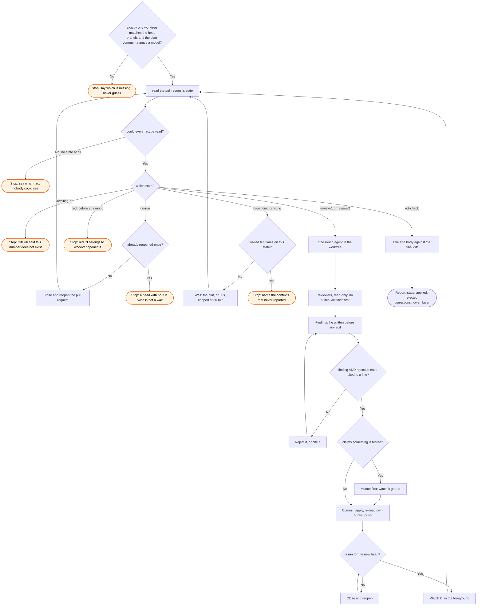

# /workstreams:review skill flow

What `/workstreams:review` does to one pull request, and every way it declines to act.

```mermaid
flowchart TD
    W{exactly one worktree matches the head<br/>branch, and the plan comment names a model?}
    W -->|No| W1([Stop: say which is missing; never guess]):::stop
    W -->|Yes| C[read the pull request's state]

    C --> D{could every fact be read?}
    D -->|No, no state at all| D1([Stop: say which fact nobody could see]):::stop
    D -->|Yes| E{which state?}

    E -->|awaiting-pr| E1([Stop: GitHub said this number does not exist]):::stop
    E -->|no-run| F{already reopened once?}
    F -->|No| F1[Close and reopen the pull request] --> C
    F -->|Yes| F2([Stop: a head with no run twice is not a wait]):::stop
    E -->|red, before any round| G([Stop: red CI belongs to whoever opened it]):::stop
    E -->|ci-pending or fixing| H{waited ten times on this state?}
    H -->|No| H1[Wait: the hint, or 60s, capped at 30 min] --> C
    H -->|Yes| H2([Stop: name the contexts that never reported]):::stop

    E -->|review-1 or review-2| I[One round agent in the worktree]
    I --> J[Reviewers, read-only, no suites, all finish first]
    J --> K[Findings file written before any edit]
    K --> L{finding AND rejection each cited to a line?}
    L -->|No| L1[Reject it, or cite it] --> K
    L -->|Yes| M{claims something is tested?}
    M -->|Yes| M1[Mutate first: watch it go red] --> N
    M -->|No| N[Commit, apply, re-read own hunks, push]
    N --> O{a run for the new head?}
    O -->|No| O1[Close and reopen] --> O
    O -->|Yes| P[Watch CI in the foreground] --> C

    E -->|rot-check| Q[Title and body against the final diff]
    Q --> S([Report: state, applied, rejected,<br/>corrections, lower_layer])

    classDef stop fill:#fff3e0,stroke:#e65100,color:#000
```
