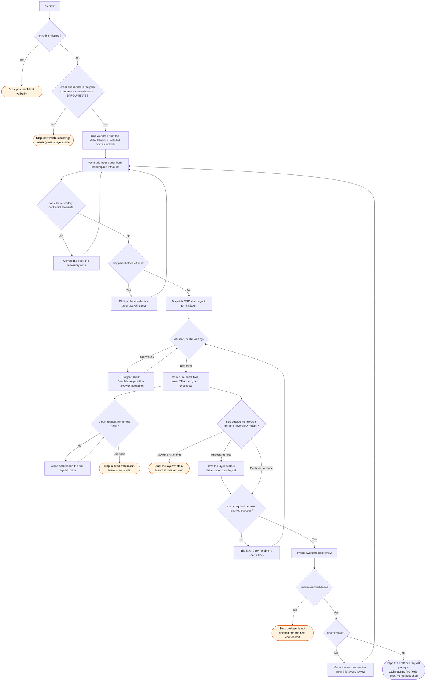

# /workstreams:stream skill flow

What `/workstreams:stream` does to one issue or one stack, and every way it declines to act.

```mermaid
flowchart TD
    A[preflight] --> B{anything missing?}
    B -->|Yes| B1([Stop: print each hint verbatim]):::stop
    B -->|No| C{order and model in the plan<br/>comment for every issue in $ARGUMENTS?}
    C -->|No| C1([Stop: say which is missing; never guess a layer's size]):::stop
    C -->|Yes| D[One worktree from the default branch, installed from its lock file]

    D --> E[Write this layer's brief from the template into a file]
    E --> F{does the repository contradict the brief?}
    F -->|Yes| F1[Correct the brief; the repository wins] --> E
    F -->|No| G{any placeholder left in it?}
    G -->|Yes| G1[Fill it; a placeholder is a layer that will guess] --> E
    G -->|No| H[Dispatch ONE sized agent for this layer]

    H --> I{returned, or still waiting?}
    I -->|Still waiting| I1[Stopped short: SendMessage with a narrower instruction] --> I
    I -->|Returned| J[Check the head: files, lower SHAs, run, both checkouts]

    J --> K{a pull_request run for the head?}
    K -->|No| K1[Close and reopen the pull request, once] --> K
    K -->|Still none| K2([Stop: a head with no run twice is not a wait]):::stop
    J --> L{files outside the allowed set, or a lower SHA moved?}
    L -->|A lower SHA moved| L1([Stop: the layer wrote a branch it does not own]):::stop
    L -->|Undeclared files| L2[Have the layer declare them under outside_set] --> M
    L -->|Declared, or none| M{every required context reported success?}
    M -->|No| M1[The layer's own problem: send it back] --> I
    M -->|Yes| N[Invoke /workstreams:review]

    N --> O{review reached done?}
    O -->|No| O1([Stop: the layer is not finished and the next cannot start]):::stop
    O -->|Yes| P{another layer?}
    P -->|Yes| P1[Grow the lessons section from this layer's review] --> E
    P -->|No| Q([Report: a draft pull request per layer,<br/>each return's five fields, cost, merge sequence])

    classDef stop fill:#fff3e0,stroke:#e65100,color:#000
    classDef pause fill:#e3f2fd,stroke:#0d47a1,color:#000
```
