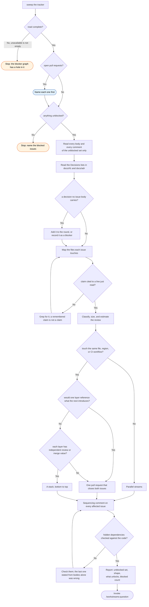

# /workstreams:sweep skill flow

What `/workstreams:sweep` does, and every way it declines to act.

```mermaid
flowchart TD
    C[sweep the tracker]

    C --> D{read complete?}
    D -->|No, unavailable is not empty| D1([Stop: the blocker graph has a hole in it]):::stop
    D -->|Yes| E{open pull requests?}
    E -->|Yes| E1([Name each one first]):::pause
    E -->|No| F
    E1 --> F{anything unblocked?}
    F -->|No| F1([Stop: name the blocked issues]):::stop
    F -->|Yes| G[Read every body and every comment<br/>of the unblocked set only]

    G --> H[Read the Decisions lists in docs/rfc and docs/adr]
    H --> I{a decision no issue body carries?}
    I -->|Yes| I1[Add it to the round, or record it as a blocker]
    I -->|No| J
    I1 --> J[Map the files each issue touches]

    J --> K{claim cited to a line just read?}
    K -->|No| K1[Grep for it; a remembered claim is not a claim]
    K1 --> J
    K -->|Yes| L[Classify, size, and estimate the review]

    L --> M{touch the same file, region, or CI workflow?}
    M -->|No| N[Parallel streams]
    M -->|Yes| O{would one layer reference what the next introduces?}
    O -->|Yes| P[One pull request that closes both issues]
    O -->|No| Q{each layer has independent review or merge value?}
    Q -->|Yes| R[A stack, bottom to top]
    Q -->|No| P

    N --> S[Sequencing comment on every affected issue]
    P --> S
    R --> S
    S --> T{hidden dependencies checked against the code?}
    T -->|No| T1[Check them; the last one stated from bodies alone was wrong]
    T1 --> S
    T -->|Yes| U[Report: unblocked set, shape,<br/>what unlocks, blocked count]
    U --> V([Invoke /workstreams:question])

    classDef stop fill:#fff3e0,stroke:#e65100,color:#000
    classDef pause fill:#e3f2fd,stroke:#0d47a1,color:#000
```
