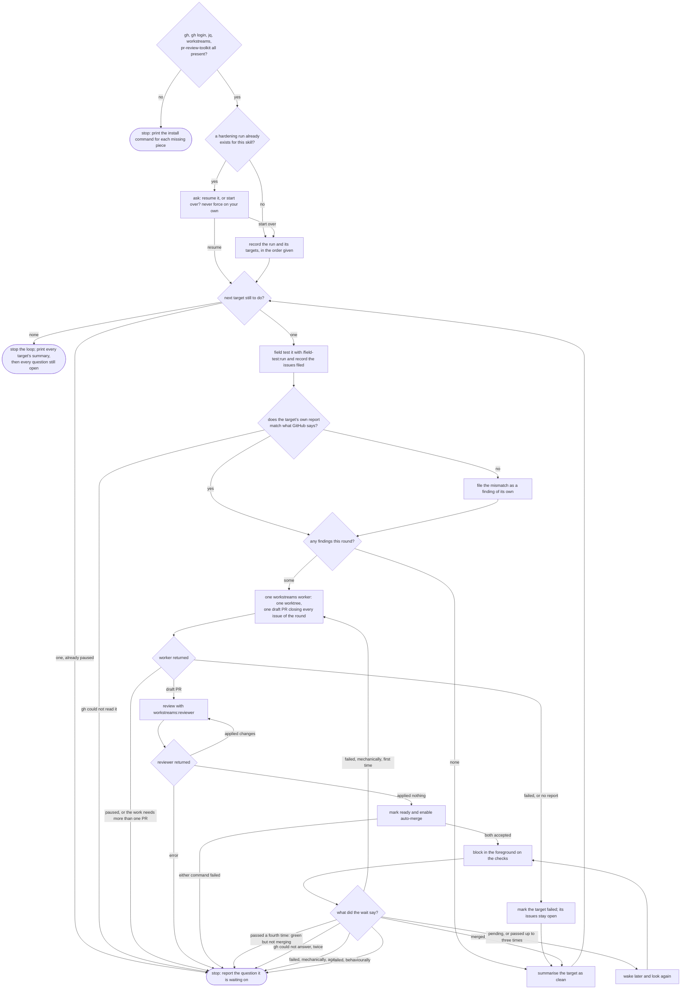

# /field-test:harden flow

```mermaid
flowchart TD
    P{gh, gh login, jq, workstreams,<br>pr-review-toolkit all present?}
    P -->|no| P1([stop: print the install command for each missing piece])
    P -->|yes| E{a hardening run already<br>exists for this skill?}
    E -->|yes| E1[ask: resume it, or start over? never force on your own]
    E -->|no| I[record the run and its targets, in the order given]
    E1 -->|resume| N
    E1 -->|start over| I
    I --> N{next target still to do?}
    N -->|none| Z
    N -->|one, already paused| Z1([stop: report the question it is waiting on])
    N -->|one| F[field test it with /field-test:run and record the issues filed]
    F --> V{does the target's own report<br>match what GitHub says?}
    V -->|no| V1[file the mismatch as a finding of its own]
    V -->|yes| C
    V -->|gh could not read it| Z1
    V1 --> C{any findings this round?}
    C -->|none| S[summarise the target as clean]
    C -->|some| W[one workstreams worker: one worktree,<br>one draft PR closing every issue of the round]
    W --> WQ{worker returned}
    WQ -->|paused, or the work needs more than one PR| Z1
    WQ -->|failed, or no report| X[mark the target failed; its issues stay open]
    X --> S
    WQ -->|draft PR| R[review with workstreams:reviewer]
    R --> RQ{reviewer returned}
    RQ -->|error| Z1
    RQ -->|applied changes| R
    RQ -->|applied nothing| M0[mark ready and enable auto-merge]
    M0 -->|either command failed| Z1
    M0 -->|both accepted| M[block in the foreground on the checks]
    M --> MQ{what did the wait say?}
    MQ -->|merged| S
    MQ -->|pending, or passed up to three times| M2[wake later and look again]
    M2 --> M
    MQ -->|passed a fourth time: green but not merging| Z1
    MQ -->|gh could not answer, twice| Z1
    MQ -->|failed, mechanically, first time| W
    MQ -->|failed, mechanically, again| Z1
    MQ -->|failed, behaviourally| Z1
    S --> N
    Z([stop the loop; print every target's summary,<br>then every question still open])
```
