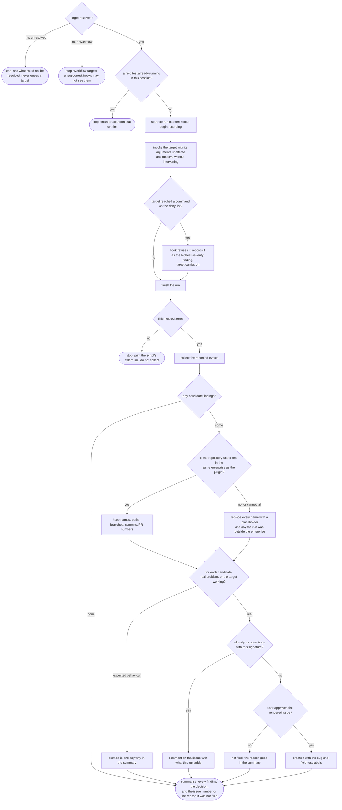

# /field-test:run flow

```mermaid
flowchart TD
    R{target resolves?}
    R -->|no, unresolved| R1([stop: say what could not be resolved; never guess a target])
    R -->|no, a Workflow| R2([stop: Workflow targets unsupported, hooks may not see them])
    R -->|yes| M{a field test already running<br>in this session?}
    M -->|yes| M1([stop: finish or abandon that run first])
    M -->|no| I[start the run marker; hooks begin recording]
    I --> T[invoke the target with its arguments unaltered<br>and observe without intervening]
    T --> D{target reached a command<br>on the deny list?}
    D -->|yes| D1[hook refuses it, records it as the highest-severity finding,<br>target carries on]
    D -->|no| C0
    D1 --> C0[finish the run]
    C0 --> C1{finish exited zero?}
    C1 -->|no| C2([stop: print the script's stderr line; do not collect])
    C1 -->|yes| C[collect the recorded events]
    C --> F{any candidate findings?}
    F -->|none| S([summarise: every finding, the decision,<br>and the issue number or the reason it was not filed])
    F -->|some| J{is the repository under test in the<br>same enterprise as the plugin?}
    J -->|yes| J1[keep names, paths, branches, commits, PR numbers]
    J -->|no, or cannot tell| J2[replace every name with a placeholder<br>and say the run was outside the enterprise]
    J1 & J2 --> E{for each candidate:<br>real problem, or the target working?}
    E -->|expected behaviour| E1[dismiss it, and say why in the summary]
    E -->|real| Q{already an open issue<br>with this signature?}
    Q -->|yes| Q1[comment on that issue with what this run adds]
    Q -->|no| U{user approves the rendered issue?}
    U -->|no| U1[not filed; the reason goes in the summary]
    U -->|yes| U2[create it with the bug and field-test labels]
    E1 & Q1 & U1 & U2 --> S
```
