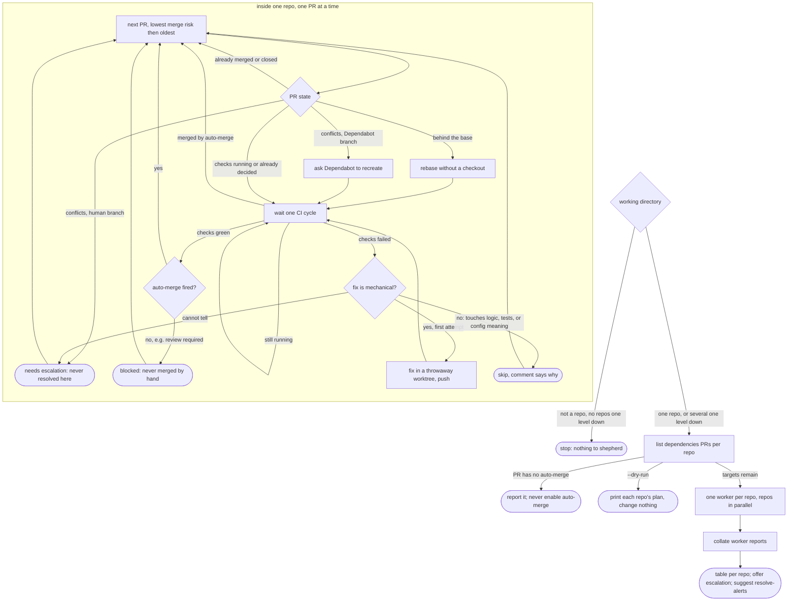

# /gh:shepherd flow

```mermaid
flowchart TD
  A{working directory} -->|not a repo, no repos one level down| Z0([stop: nothing to shepherd])
  A -->|one repo, or several one level down| B[list dependencies PRs per repo]
  B -->|PR has no auto-merge| N([report it; never enable auto-merge])
  B -->|--dry-run| Z2([print each repo's plan, change nothing])
  B -->|targets remain| C[one worker per repo, repos in parallel]
  subgraph worker [inside one repo, one PR at a time]
    direction TB
    S[next PR, lowest merge risk then oldest] --> T{PR state}
    T -->|already merged or closed| S
    T -->|behind the base| R[rebase without a checkout] --> W[wait one CI cycle]
    T -->|conflicts, Dependabot branch| RC[ask Dependabot to recreate] --> W
    T -->|conflicts, human branch| E([needs escalation: never resolved here]) --> S
    T -->|checks running or already decided| W
    W -->|merged by auto-merge| S
    W -->|checks green| P{auto-merge fired?}
    P -->|yes| S
    P -->|no, e.g. review required| BL([blocked: never merged by hand]) --> S
    W -->|still running| W
    W -->|checks failed| K{fix is mechanical?}
    K -->|yes, first attempt| F[fix in a throwaway worktree, push] --> W
    K -->|no: touches logic, tests, or config meaning| SK([skip, comment says why]) --> S
    K -->|cannot tell| E
  end
  C --> D[collate worker reports]
  D --> Z3([table per repo; offer escalation; suggest resolve-alerts])
```
