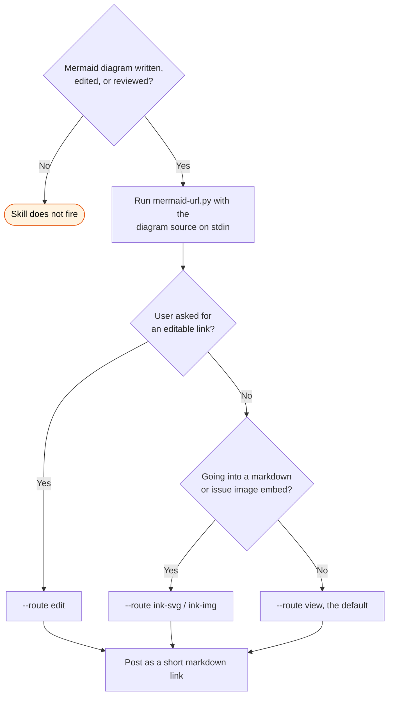

# view — flow

```mermaid
flowchart TD
    A{Mermaid diagram written,<br/>edited, or reviewed?}
    A -->|No| Z([Skill does not fire]):::stop
    A -->|Yes| B[Run mermaid-url.py with the<br/>diagram source on stdin]

    B --> C{User asked for<br/>an editable link?}
    C -->|Yes| D[--route edit]
    C -->|No| E{Going into a markdown<br/>or issue image embed?}
    E -->|Yes| F[--route ink-svg / ink-img]
    E -->|No| G[--route view, the default]

    D --> H[Post as a short markdown link]
    F --> H
    G --> H

    classDef stop fill:#fff3e0,stroke:#e65100,color:#000
```

The URL is never posted bare: it is long, and a raw fragment reads as noise in chat.
