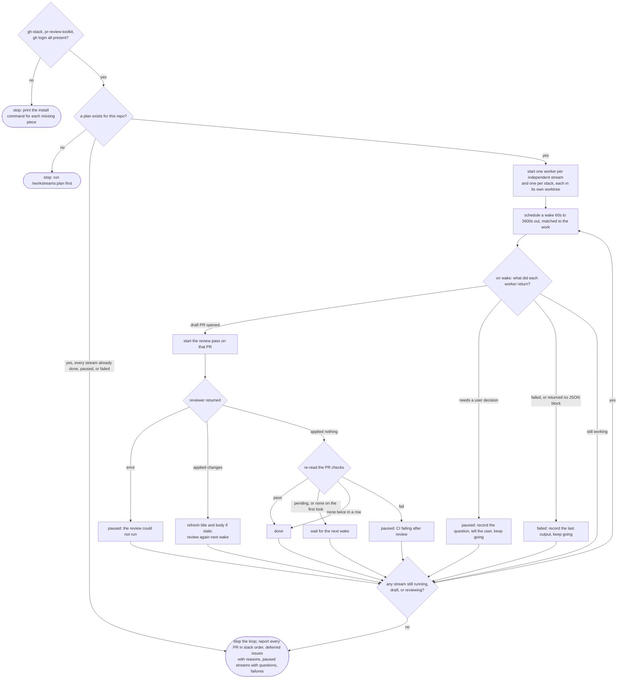

# /workstreams:run flow

```mermaid
flowchart TD
    P{gh-stack, pr-review-toolkit,<br>gh login all present?}
    P -->|no| P1([stop: print the install command for each missing piece])
    P -->|yes| S{a plan exists for this repo?}
    S -->|no| S1([stop: run /workstreams:plan first])
    S -->|yes, every stream already done, paused, or failed| Z
    S -->|yes| L[start one worker per independent stream<br>and one per stack, each in its own worktree]
    L --> T[schedule a wake 60s to 3600s out, matched to the work]
    T --> W{on wake: what did each worker return?}
    W -->|draft PR opened| R[start the review pass on that PR]
    W -->|needs a user decision| Pz[paused: record the question, tell the user, keep going]
    W -->|failed, or returned no JSON block| F[failed: record the last output, keep going]
    W -->|still working| A
    R --> V{reviewer returned}
    V -->|error| Pz2[paused: the review could not run]
    V -->|applied changes| R2[refresh title and body if stale;<br>review again next wake]
    V -->|applied nothing| C{re-read the PR checks}
    C -->|pass| D[done]
    C -->|pending, or none on the first look| C1[wait for the next wake]
    C -->|none twice in a row| D
    C -->|fail| Pz3[paused: CI failing after review]
    D & Pz & Pz2 & Pz3 & F & R2 & C1 --> A{any stream still running,<br>draft, or reviewing?}
    A -->|yes| T
    A -->|no| Z([stop the loop; report every PR in stack order, deferred issues<br>with reasons, paused streams with questions, failures])
```
